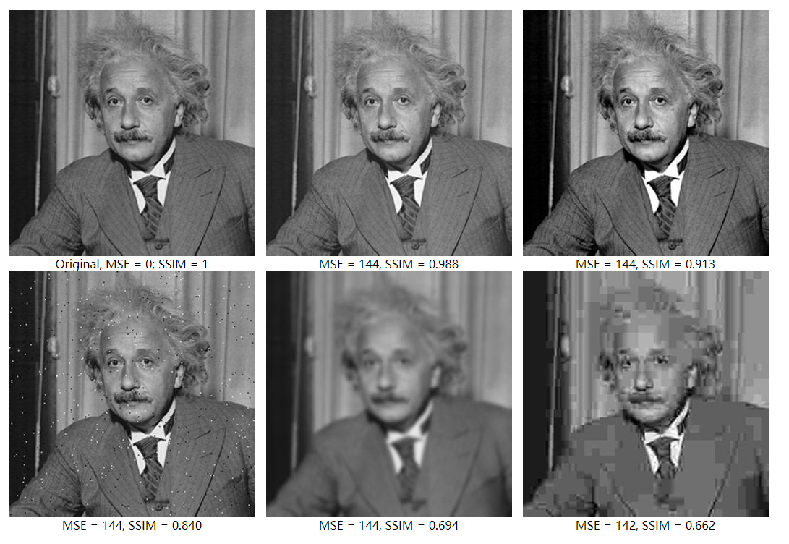

## 视频质量评估

视频质量的评估主要分为两类，一种叫主观评估，一种叫客观评估。   

主观评估，顾名思义即人工评估，视频质量的评价是通过选择一批非专家类型的受测者，让他们参加一些培训后，在特定的环境下，连续观看一系列测试序列，然后对视频序列的质量进行评估。主观评估的个体差异性较大，而且对观看环境、测试序列的选择、播放顺序、时间间隔等等都有要求。

客观评估是通过一些评估标准来衡量视频的质量，其实就是对每一帧的视频质量进行量化。客观评估又可以分为参考评估和无参考评估，有参考评估就是依赖原始视频和待测视频进行对比，方法有PSNR、SSIM、VIF、VMAF等；无参考评估是指判断视频的质量不需要依赖原始视频的任何信息，通过对失真视频的空域和频域的处理分析来提取失真视频的特征，或基于视频像素的质量模型来得到视频质量。

### SSIM 结构相似性

结构相似性是一种用以衡量两张数位影像相似程度的指标，当两张影像其中一张为无失真影像，另一张为失真后的影像，二者的结构相似性可看做失真影像的影像品质衡量指标。相较于 PSNR，SSIM 更符合人眼对影像品质的判断。

结构相似性的基本概念为自然影像是高度结构化的，即在自然影像中相邻像素之间有很强的关联性，而这样的关联性承载了场景中物体的结构咨询。人类视觉系统在观看影像时已经很习惯抽取这样的结构性咨询。因此，在设计影像品质衡量指标用以衡量影像失真程度时，结构性的衡量时很重要的一环。

结构相似性指标具有下列性质：

* 对称性，结构相似性指标都是对称的，亦即 SSIM(x, y) = SSIM(y, x)。
* 有上下界，结构相似性指标的范围为 [-1, 1]，当衡量的两个信号完全相同时，结构相似性指标值为 1。

下面给出一个示例，下图中所有的图片都用相同的 MSE，但有完全不同的图像质量，SSIM 对于图像质量，是一个更好的指标。

SSIM 的计算公式大致如下：  

SSIM(x, y) = ((2u~x~ * u~y~ + c~1~) * (2 * σ~xy~ + c~2~)) / ((u~x~^2^ + u~y~^2^ + c~1~) * (σ~x~^2^ + σ~y~^2^ + c~2~))

其中  
* u~x~ 是 x 的平均。
* u~y~ 是 y 的平均。
* σ~x~^2^ 是 x 的方差。
* σ~y~^2^ 是 y 的方差。
* σ~xy~ 是 x 和 y 的协方差。

实现代码可以参考如下两个实现：

[A standalone tool for measuring SSIM](https://github.com/jrmuizel/ssim)  
[A single and multi-scale SSIM implementation in C++](https://github.com/thorfdbg/ssim)
